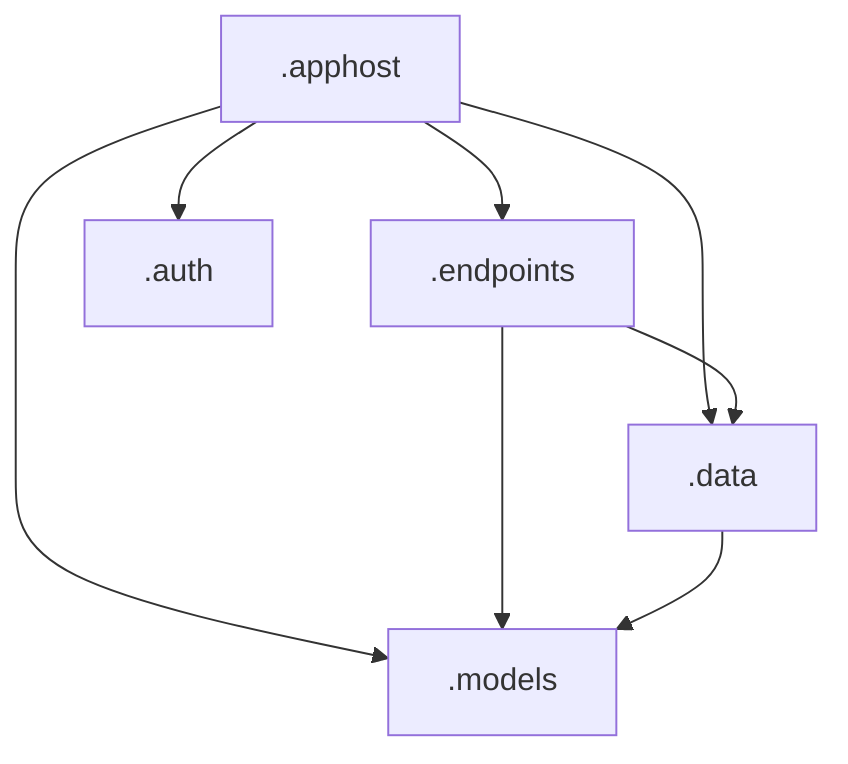

# PLEASE READ THIS DOCUMENT BEFORE USING THIS REPOSITORY. IT CONTAINS IMPORTANT INSTRUCTIONS FOR SETUP.

# How to use this repository
1. Either:
   - navigate to the root of this repository, at the top right is a green button that says "Use this template". Select "Create a new repository" and follow the instructions.
   - OR from https://github.com/orgs/cchmc/repositories, click the green "New repository" button and in the following screen, select this repository as the template.
2. In a few moments your new repository will be made and look just like this one. In `cookiecutter.json` in your `main` branch, edit the values for `owning_department` and `project_name` to match your repository name. For example, to match `org.cchmc.billing.patientrefunds` you would set `owning_department` to "billing" and `project_name` to "patientrefunds". However, you can use any combination of spaces or capital letters as you prefer - the cookiecutter setup will strip any spaces and force to lower case wherever the values are being used in code. Where the values are being used in text (for example, to title your Swagger documentation page) the original text will be preserved (e.g. "Patient Refunds" over "patientrefunds").
3. In Github, navigate to the Actions tab of your new repository and select the action "Setup Repository". Run it against your `main` branch. Cookiecutter will be executed and begin the mass renaming and text replacement. When the action is complete, your repository should look like a brand new repository with all the files and folders named to your specification. If it doesn't look the way you want, delete the repository at this point and start over.
4. Adjust all of your repository settings according to [our team standard](https://github.com/cchmc/.swe-documentation/tree/main/creating-a-repo). Don't forget to create your pipeline back in DevOps.
5. At this point your project might not successfully pass all the tests, especially the architecture tests. **This is totally normal and expected.** This is boilerplate code intended to get you started, not a final product. Some suggestions:
   - `.endpoints/Endpoints/SampleEndpoints.cs`, `.endpoints/Configuration/EndpointMapper.Sample.cs`, and `.unittests/EndpointTests/SampleEndpointsUnitTests.cs`: These are classes to show some very simple examples of minimal APIs. If you aren't going to rename and reuse the files, remove them entirely and their reference in `Program.cs`.
     - Also in the `SampleEndpoints` is a reference to an implementation of [data redaction](https://learn.microsoft.com/en-us/dotnet/core/extensions/data-redaction?tabs=dotnet-cli), a feature from .NET 8. There are several associated files in this sample implementation that you might also want to remove:
       - `.models/ViewModels/ExampleInput.cs`
       - `LogReceivedData(...)` in `.data/Logging/LoggerMessages.cs`
       - If you aren't going to use the redaction at all, you can remove these files (and empty folders) as well as:
         - Slim down `.apphost/Configuration/ApiBuilder.Logging.cs` appropriately
         - Remove `Microsoft.Extensions.Compliance.Redaction` from `.apphost` and `.models`
         - Potentially remove `Microsoft.Extensions.Telemetry` from `.apphost` and `.models` (if you aren't using it for other things)
   - Look around the project for high-level concepts you won't be using and remove the unnecessary code, such as (but not limited to!):
     - If you aren't using SingleSignOn, remove the entire `.auth` project and all of its references in `Program.cs` and the settings in appsettings.
     - If you aren't using SignalR, there are builders for it in the `.data` project (as well as a placeholder folder, `Hubs`).
   - If you are using SingleSignOn, you'll still need to do the setup in the SSO Admin portal as well as adding the appropriate settings to your appsettings.
6. Rename `.data/DbContexts/ProjectDbContext.cs` appropriately.
7. You and your project team should discuss how to define your project architecture and make the appropriate changes to your architecture tests. 

# About this repository
This repository is a starting template for .NET 10 API projects. The intent is to provide a common solution structure for all projects without the need to create a series of projects, import all your nuget packages, and establish all of your boilerplate code. 99% of that is present in this code already. This diagram shows the references between projects (excluding the unit test project, which references all projects):



Before writing any code, please look at the project structure and the folders underneath each one to better understand where items might best live.

* **apphost** - This is the destination for anything related to how your application is instantiated. In this template it contains `Program.cs` as well as files & classes pertaining to logging, initial setup of health checks, and the boilerplate code that determines when to route request to your endpoints vs when to route requests to your javascript front-end. The intent here is this project remains small and only related to the initial launch of the application.
* **auth** - This project contains all of the files related to SingleSignOn.
* **endpoints** - These are all of the classes that represent entry-points to your application. The definition for minimal APIs (replacements for Controllers) live here.
* **data** - This is the home of any data services, repositories, and any other non-orchestration-related classes that your APIs might require.
* **models** - There should be very little logic in this project; try to keep it to just definitions of DTOs and any mappings between them.
* **unittests** - Hopefully self explanatory? :)

## What's New?
There are three significant differences between this template and the previous template, outside of the overall project structure.

### Builders & Dependency Injection
First, this repository is structured according to the best practices that Microsoft recommends for configuring your dependencies. Wherever you have a class that needs to be added to your builder's services/configuration or your application's setup of said dependency, those builder instructions should live in the same assembly as the class. This keeps any direct dependency references you need within a single assembly instead of needing to be duplicated just for `Program.cs`. For example, if your repositories require Entity Framework, that nuget package should only be directly referenced in your `.data.csproj`. A transitive reference will appear in your `.apphost` project because that project references your `.data` project but Entity Framework will not appear in your `.apphost.csproj` file.

Each project that has builders stores them in the `Configuration` namespace. For clarity, the files use the `ApiBuilder.[Concept].cs` file name pattern (e.g. `ApiBuilder.Repositories.cs`) and are declared as `public static partial class ApiBuilder`.

Remember that when it comes to building your dependencies (i.e. anything you might do via `builder.Services...` or `builder.Configuration....`) in your project, the order does not matter. When it comes to *configuring* the use of them in your application (i.e. anything you might do via `var app = builder.Build(); app....`) the order is very important!

### Minimal APIs
Microsoft has been advocating [minimal APIs](https://learn.microsoft.com/en-us/aspnet/core/getting-started/?view=aspnetcore-9.0) over controllers going back to .NET 6. This template embraces the minimal API shift and provides a basic example in `.endpoints/Endpoints/SampleEndpoints.cs` and a final product in `.auth/Endpoints/AuthEndpoints.cs`. The classes containing the endpoint logic closely resemble the previous `Controller` definitions, with some key differences:
- The class itself does not have dependency injection; this is now done at the method level. This gives you finer control over which dependencies are used in which methods at the expense of longer method signatures. Additionally, because the methods are static and the class is not, you cannot access class-level DI objects within static methods. Static classes cannot have dependency injection. The methods need to be static so they can be referenced for mapping.
- These endpoint classes do not have `[ApiController]`, `[Route]`, or `[Authorize]` attributes. These attributes are replaced by the Fluent API for mapping routes (more on this in a bit).
- Endpoint methods do not have Swagger attributes, which are replaced with an improved method signature. This new signature provides build-time errors for methods that return status codes not explicitly mentioned in the signature.
  ```diff
  -[SwaggerResponse(200, type: typeof(ApplicationViewModel))]
  -[SwaggerResponse(404)]
  -[SwaggerResponse(500, type: typeof(string))]
  -public async Task<IActionResult> GetApplication(Guid applicationKey) { ... }
  +public static async Task<Results<Ok<ApplicationViewModel>, NotFound, ProblemHttpResult>> GetApplication([FromRoute]Guid applicationKey, ILogger<ApplicationEndpoints> _logger, IApplication _applications, IMapper _mapper)
  ```
- Because dependency injection is pushed to the methods, there are attributes you can use to differentiate where each parameter comes from. You can refer to the [documentation from Microsoft](https://learn.microsoft.com/en-us/aspnet/core/fundamentals/minimal-apis/parameter-binding?view=aspnetcore-9.0) or see some examples in the `.endpoints/Endpoints/SampleEndpoints.cs` file. In most cases, .NET will be smart enough to correctly identify where each parameter will come from, however you might find it valuable for future developers to know where to expect these values to come from.
- There are no more `[ApiController]`, `[Route]`, or `[Authorize]` attributes because there are now separate builders for [defining these routes](https://learn.microsoft.com/en-us/aspnet/core/fundamentals/minimal-apis/route-handlers?view=aspnetcore-9.0). You can find an example in this template at `.endpoints/Configuration/EndpointMapper.Sample.cs.` and the usage on line 71 of `Program.cs`. You can also find a more complex, real example in `.auth/Configuration/EndpointMapper.SingleSignOn.cs`. Some of these are necessary for routing (e.g. `.MapGet()`, `.MapPost()`, etc.) and some are helpful for Swagger/OpenAPI documentation (`.WithName()`, `.WithDescription()`, `.WithSummary()`, etc.) while some are controlling authorization/authentication (e.g. `.RequireAuthorization()`). Take a peek at the methods available with Intellisense and see which ones you and your team find valuable for your project.  
```csharp
public static void MapSingleSignOnEndpoints(this WebApplication app)
{
    var ssoItems = app.MapGroup("/api/Auth");

    ssoItems.MapGet("/SignIn", AuthEndpoints.SignIn)
            .WithName("SignIn")
            .WithDescription("Gets sign-in information for connecting to SSO");

    ssoItems.MapPost("/CompleteSignIn", AuthEndpoints.CompleteSignIn)
            .WithName("CompleteSignIn")
            .WithDescription("Takes a signInToken and exchanges it for a cookie & JWT");

    ssoItems.MapPost("/SsoSignOut", AuthEndpoints.SsoSignOut)
            .WithName("SsoSignOut")
            .WithDescription("Destroys the user's cookie and revokes their session in SSO");

    ssoItems.MapPost("/AcknowledgeAlert/{alertId}", AuthEndpoints.AcknowledgeAlert)
            .WithName("AcknowledgeAlert")
            .WithDescription("Marks the alert as read")
            .RequireAuthorization();

    ssoItems.MapGet("/GetUserInformation", AuthEndpoints.GetUserInformation)
            .WithName("GetUserInformation")
            .WithDescription("Interrogates the user's cookie to rebuild their JWT and user object")
            .RequireAuthorization();
}
```

### Appsettings via static class rather than dependency injection
On lines 34 & 35 of `Program.cs` are where the database connection string and everything in `CustomOptions` is stored into a static class called `GlobalConfiguration`. Anywhere within the app you can get to the `CustomOptions` fields via `GlobalConfiguration`. This saves a lot of overhead of injecting `IOptions<CustomOptions>` into your classes.

## What's included?
Out of the box, the template has configuration for:
- NLog (with the ability to redact sensitive and/or personal data)
- appsettings & appsettings.secrets import
- SignalR hub registration (you must populate `.endpoints/Configuration/ApiBuilder.SignalR.cs`)
- Health Checks enabled and serving the standard HttpResult format
- Cookie-based SingleSignOn
- DbContext factory registration, repositories, and DbContext health check (you must populate `.data/Configuration/ApiBuilder.Repositories.cs`)
- `IBaseRepository` and `BaseRepository`
- Swagger documentation
- `RequestResponseLoggingMiddleware`
- Our standard GitHub Action workflows, DevOps build pipeline, readme template, code coverage settings, and changelog template

## What's -not- included?
- The absolute latest version of every single package. Recommend you update all of these before you begin with your code.
- SingleSignOn settings
- Front end web project

## Where do I put things?
- DbContexts belong in `.data/DbContexts`.
- Repositories belong in `.data/Repositories`.
- Service classes for connection to downstream resources (other APIs, SMTP, etc.) belong in `.data/Services`.
- Any model mapping between third party bundled models and models found in `.models` belong in `.data/Mappings/Mappings.cs`. Any models for third party services that are not bundled (e.g. Interconnect models) belong in `.models/ExternalModels` and should be mapped in `.models/Mappings/ModelMappings.cs`.
- Interfaces for Repositories and Services belong in `.data/Interfaces`.
- SignalR Hubs belong in `.data/Hubs`. This ensures that no matter if a BackgroundService, regular Service, or Endpoint need to reference them, they are in the same or lower-referenced project.
- Endpoint orchestrations belong in `.endpoints/Endpoints`. Endpoint declarations belong in `.endpoints/Configuration/EndpointMapper.TopLevelRouteName.cs`.
- Background Services belong in `.data/BackgroundServices`.

## Where should I put the configuration for things?
- `.data/Configuration/ApiBuilder.Repositories.cs` should have everything it takes to inject your repositories into DI. This includes your DbContext and all the associated health checks.
- `.data/Configuration/ApiBuilder.Services.cs` should have everything it takes to inject your services into DI. This includes any HTTP clients or health checks.
- `.data/Configuration/ApiBuilder.SignalR.cs` should configure everything you need to stand up your SignalR hubs.
- `.endpoints/Configuration/EndpointMapper.TopLevelRouteName.cs` has the definition for endpoints in the `TopLevelRouteName` path. For example, `EndpointMapper.Banks.cs` has the definition for routes under the `/bank` path.
- `.apphost/Configuration/ApiBuilder.HealthChecks.cs` configures all application-level health check setup. Currently it only offers a health check for the memory being > 500mb.
- `.apphost/Configuration/ApiBuilder.UserInterface.cs` registers the UI health check as well as the rules for when to route the user to the javascript vs the API routes.
- `.apphost/Configuration/ApiBuilder.Logging.cs` contains configuration for NLog
